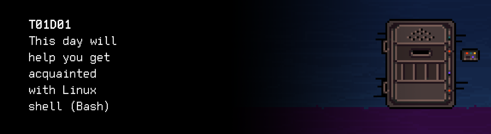

# T01D01

Foydali video materiallarni Platformadagi “Loyihalar (Media)” bo‘limida topishing mumkin. 

## Contents

1. [Chapter I](#chapter-i) \
    1.1. [Readme!](#readme)  
    1.2. [Level 1. Room 1.](#level-1-room-1)
2. [Chapter II](#chapter-ii) \
    2.1. [List 1.](#list-1)  
    2.2. [List 2.](#list-2)  
    2.3. [List 3.](#list-3)  
    2.4. [List 4.](#list-4)  
3. [Chapter III](#chapter-iii) \
    3.1. [Quest 1. Clone.](#quest-1-clone)  
    3.2. [Quest 2. Repo.](#quest-2-repo)  
    3.3. [Quest 3. Dirs & Files.](#quest-3-dirs-files)  
    3.4. [Quest 4. Kill him.](#quest-4-kill-him)  
    3.5. [Quest 5. Conf.](#quest-5-conf)  
    3.6. [Quest 6. Rm.](#quest-6-rm)  
    3.7. [Quest 7. Branches.](#quest-7-branches)  
4. [Chapter IV](#chapter-iv) 

# Chapter I

## Readme!

***LOADING… …***

***SUCCESS!***

\>

Dasturchilardan: \
Salom, aziz do‘stim! \
Seni o‘yin o‘ynashga taklif qilamiz.
O‘yin - boshqotirma elementlari bilan eski yaxshi matnga asoslangan kvest o‘yinlari ruhida. Har bir topshiriq - yangi bir sinovdir, odatda ba’zi bir to‘siqlarni yengib o‘tish kerak bo‘ladi. \
Hammasini yengib o‘tgan odamgina oldinga harakat qila oladi. 

Quyida yo‘lingizni topishga yordam beradigan ba’zi maslahatlar keltirilgan: 
1. Butun yo‘l bo‘ylab senga noaniqlik hissi va ma’lumotlarning keskin yetishmasligi hamroh bo‘ladi: BU - ODATIY HOL. Bu o‘yinning bir qismi. Unitma, ma’lumotlar ombori va Google hamisha sen bilan. Boshqa o‘yinchilar kabi, murojaat qil. Qidir. Jamla. Xato qilishdan qo‘rqma. 
2. O‘yin ichida boshqa bir o‘yin bo‘lishi mumkin, unda esa yana boshqasi bo‘ladi. Bu normal holat. Xuddi hayotdagidek. Rekursiya go‘zal. 
3. Darajalar bir-biridan keskin farq qilishi mumkin. Bu normal holat. Bu o‘yinning bir qismi. Sen bitta retseptni o‘rganib, uni hamma joyda qo‘llay olmaysan. Faqat doimiy o‘rganish va moslashish orqali sen maqsadinga erishishing mumkin.
4. Bizning o‘yinimiz - ko‘p foydalanuvchili hisoblanadi, garchi senga dastlab boshqacha tuyulsa ham. Biroq, sen yo‘lning ko‘p qismini yolg’iz bosib o‘tishing mumkin. 
5. Ma’lumot manbalariga ehtiyot bo’l. Tekshir. O‘ylab ko’r. Tahlil qil. Taqqosla. Ishonma.
6. Topshiriq matniga e’tibor ber. O‘ylab ko‘r. Tekshir.
7. Agar vazifa tushunarsiz yoki bajarish imkonsiz bo‘lib tuyulsa, bu faqat shunday ko‘rinadi. Shunchaki tinch holatda o‘tir, sokinlikda, yoki sevimli musiqangni qo‘y. 10-15 daqiqadan so‘ng vazifaga qayt va uni to‘liq qayta o‘qi.
9. Agar 8-bosqich yordam bermasa, yo‘riqnomani qidir. Atrofingizda sen kabi ko‘plab sayohatchilar bor va ular senga chiqish yo‘lini topishga yordam berishdan xursand bo‘lishadi.
10. Vaqtni kuzatib bor! Bu hiyla-nayrang. Sen kuniga kamida bitta qiyinchilikni yengib o‘tishing kerak!
11. Ehtiyot bo‘l va muhim narsani o‘tkazib yuborma. Ma’lumotlar omborini diqqat bilan o‘rgan! 
12. Hamisha push ni faqat develop tarmog‘ida bajar! Master tarmog‘i e’tiborga olinmaydi. src katologida ishla.
13. Unitma, har bir vazifa bir qator tekshiruvlardan o‘tadi: kod uslubini tekshirish, statik analizator bilan tekshirish, xotira bilan to‘g’ri ishlashni tekshirish, avtotestlar to‘plami bilan tekshirish, nazorat ro‘yxati bilan tekshirish. Ehtiyot bo‘l.
14. Yo‘ling mobaynida sen turli xil vazifalarga duch kelasan. Yulduzcha (*) bilan belgilanganlar faqat eng umidsizlar uchun mos keladi. Ularning murakkabligi oshgan va umuman olganda, majburiy emas. Ammo ularni bajarsang, qo‘shimcha tajriba va bilimga ega bo‘lasan.
15. Ba’zida muhimdek ko‘rinadigan narsa aslida muhim emas. 
16. Esingda bo‘lsin, oxir-oqibat, to‘siqni yengib o’tish haqiqati uni QANDAY yengib o‘tganing kabi muhim emas. 
17. Bizning sayohatimizning asosiy maqsadi "QANDAY" nima ekanligini tushunishdir.
18. Bug’doyni somondan ajrat.
19. Ajrat va boshqar. Parchala.
20. Asosiy narsa haqida o‘yla (yaxshi kod haqida, albatta). Umumiylikdan xususiylikga ergash.
21. Aldama, tizimni va atrofingdagilarni aldashga urinma. Birinchi navbatda, sen o‘zingizni aldagan bo‘lasan.
22. Ko‘chirma va agar sen yordamdan foydalansang, uni har doim oxirigacha, nimaga, qanday qilib va ​​nima uchunligini tushunib ol. Aks holda, sayohat hech qanday ma’noga ega bo‘lmaydi. 
23. Materials papkasini tez-tez tekshir. U yerda juda ko‘p foydali ma’lumotlar bo‘lishi mumkin! 
24. Ko‘rsatmalarni bir necha marotaba o‘qib chiq. 

***PRESS ANY KEY TO CONTINUE………………***

## Level 1. Room 1.

***LOADING Level 1…***

***LOADING Room 1…***

\> *Atrofga qara*

Sen noma’lum xonadasan. Sening oldingdagi kichik stolda eski IBM PC ga mos keladigan kompyuter joylashgan. Stolda issiq, qulay yorug’lik beruvchi Pixar stol chirog’i, bir nechta sarg’aygan qog’oz varaqlari va bir chashka issiq qahva mavjud. \
Qarama-qarshi devorda sen yopiq eshikni ko‘rasan. Ko‘rinishidan, elektronniy qulf, chunki unda tutqich ham, qulf ham yo‘q.

\> *Eshikni tort*

Tutqich yo‘q. Tortish uchun hech narsa yo‘q.

\> *Eshikni buzish*

Og’riqli. Va boshqa ta’sir yo’q.

\> *Stolga o‘tir*

Sen stolda o‘tiribsan. Va undan keyin nima? \
Lekin bu yerda hech bo‘lmaganda og’riq yo‘q.

\> *Qahva ich*

Umuman olganda, bu unchalik ham yomon emas!

\> *Qahva ich*

Umuman olganda, bu unchalik ham yomon emas!

\> *Qahva ich*

Umuman olganda, bu unchalik ham yomon emas!

\> *Qahva ich*

Qahva tugadi. 

\> *Stolga qara*

Qog’oz varaqlari, g’ayrioddiy narsa yo‘q. Ko‘p matn. \
Bir varaqda matn kamroq va bu diqqatni tortdi. \

/***Kompyuterni yoq***/

\> *Kompyuterni yoq*

Yoqish tugmasini uzoq vaqt qidirishingiz shart emas - bu katta analog kalit. Mashina jiringladi va ekran miltillovchi kursorni ko‘rsatdi.

\> *Sichqonchani qidir*

Sichqoncha yo’q.

\> *Derazani qidir*

Deraza yo‘q. Faqat eshik. Ekranda ham deraza yo‘q...

\> *Enter tugmasini bos*

Kursor keyingi qatorga o‘tdi.

\> *Kut*

Hech nima sodir bo‘lmayapti. 

\> *Kut*

Hech nima sodir bo‘lmayapti. 

\> *Stolga qara*

Qog’oz varaqlari, g’ayrioddiy narsa yo‘q. Ko‘p matn. \
O‘qib chiqilgan varaq ostida boshqalari ham bor.

\> *Varaqlarni o‘qi.*

***LOADING...***

# Chapter II

## List 1.

Linux tarixi 1991-yilda Finlyandiyalik aspirant dasturchi Linus Torvalds o‘zining kompyuteri uchun operatsion tizim yadrosini ishlab chiqishni boshlagan paytdan boshlanadi.

U o‘z ishini umumiy serverga joylashtirdi va bu Linux tarixidagi muhim voqea bo‘ldi. Birinchidan, o‘nlab, keyin yuzlab va minglab dasturchilar uning loyihasini qo‘llab-quvvatladilar, ularning birgalikdagi sa’y-harakatlari bilan to‘laqonli operatsion tizim paydo bo’ldi.
Linuxga Unix tizimi sezilarli darajada ta’sir ko‘rsatdi, buni nomidan ham payqash mumkin. Birinchi rasmiy Linux 1.0 versiya 1994-yilda chiqarilgan. Eng boshidan shu kungacha Linux GPL litsenziyasi ostida bepul dasturiy ta’minot sifatida tarqalmoqda. Bu shuni anglatadiki, har qanday foydalanuvchi operatsion tizimning manba kodini ko‘rishi mumkin va uni nafaqat ko‘rishi, shuningdek o‘zgartirishi ham mumkin. Yagona shart - o‘zgartirilgan, modifikatsiya qilingan kod ham hamma uchun ochiq bo‘lishi va GPL litsenziyasi ostida tarqatilishi kerak. Bu juda muhim, chunki bu ishlab chiquvchilarga mualliflik huquqi bilan bog’liq muammolar haqida tashvishlanmasdan koddan foydalanishga imkon beradi.

Keyingi - qahvadan katta dog’.

\> *Keyingi varaqni o‘qi*

***LOADING...***

## List 2.

Varaq printer tomonidan chaynalgan. Ko‘rinishidan matritsalik. 

>3. Avvaliga Torvalds o‘zi yaratgan tizimni Freax (free, freak va X harfi so‘zlarining gibridi bo‘lib, u Unix tizimlariga tegishli ekanligini bildiradi) deb nomlamoqchi edi, lekin operatsion tizimni tarqatish uchun unga serverda joy ajratgan tizim ma’muri katologni Linux deb nomladi.
>4. Linux logotipini tanlash uchun uzoq vaqt kerak bo‘ldi va nihoyat Tux pingviniga qaror qilindi. Torvalds o‘zining "Faqat o‘yin-kulgi" (Just for Fun) kitobida aynan pingvinni timsol sifatida tanlaganining sababi, uni bir vaqtlar hayvonot bog’ida pingvin tishlab olganligini yozadi. (bu voqea 1993-yilda Avstraliyada sodir bo‘lgan);
>5. Linux umimiy maqsadagi operatsion tizimlar orasida o‘rnatishlar soni bo‘yicha mutlaq chempiondir.
U deyarli hamma joyda mavjud: dunyoning eng yaxshi 500 taligidagi barcha superkompyuterlarda, Android telefonlarida, Chromebooklarda,
barcha turdagi o‘rnatilgan qurilmalarda, elektron kitoblarda, smart televizorlarda va boshqa joylarda;
>6. Linux yadrosi C tilida yozilgan;
>7. Linux yadrosining 1.0.0 versiyasi 176250 kod satrlari bilan chiqarildi. Hozirgi vaqtda Linux yadrosi 10 milliondan ortiq kod satrlardan iborat; 

\> *Keyingi varaqni o‘qi*

***LOADING...***

## List 3.

>Bourne shell (ko‘pincha bajariladigan fayl nomi bo‘yicha sh) - UNIXning dastlabki buyruqlar qobig’i, Steven Born va Bell Labs tomonidan ishlab chiqilgan va UNIX operatsion tizimining 
7-versiyasining bir qismi sifatida chiqarilgan (1978). Bu qobiq de-fakto standart hisoblanadi va deyarli har qanday *nix distribyuterlarda mavjud.
>
>"Bash" nomi ingliz tilidagi qisqartmasi. Bourne-again-shell ("yana bir Bournening buyruq qobig’i") va bu so‘z o‘yini: Bourne-shell - UNIX (sh) uchun buyruq qobig’ining mashhur variantlaridan biri, muallifi Steven Born, 1987-yilda Brayan Fox tomonidan takomillashtirilgan. Bourne familiyasi inglizcha born so‘zini anglatadi, bu "tug’ilgan" degan ma’noni anglatadi, shuning uchun: qayta tug’ilgan buyruq qobig’i.

\> *Keyingi varaqni o‘qi*

***LOADING…***

## List 4.

>Git - bu taqsimlangan versiyani boshqarish tizimi. Loyiha Linus Torvalds tomonidan Linux yadrosining rivojlanishini boshqarish uchun yaratilgan bo‘lib, birinchi versiyasi 2005-yil 7-aprelda chiqarilgan. Keyinchalik u buni rivojlantirish va qo‘llab-quvvatlashni Junio Hamanoga topshirdi.
>
>Bugungi kunda bu dasturchilar uchun jamoaviy ishlash vositalari orasida de-fakto standartdir.
>
>Dastur bepul va GNU GPL litsenziyasining 2-versiyasi ostida chiqariladi. Standart sifatida TCP porti 9418 ishlatiladi.
>
>Linux yadrosini ishlab chiqish xususiy BitKeeper tizimida amalga oshirildi, muallifi Linux dasturchisi Larri Mcvoy — loyihani bepul litsenziya bilan taʼminlagan. Ishlab chiquvchilar, yuqori malakali dasturchilar, bir nechta yordamchi dasturlarni yozdilar va bittasini Andrew Tridgell BitKeeper ma’lumotlar uzatish formatini teskari loyihalashtirdi. Bunga javoban Mcvoy ishlab chiquvchilarni shartnomani buzganlikda aybladi va litsenziyani bekor qildi va Torvalds yangi tizimga kirishdi: ochiq tizimlarning hech biri minglab dasturchilarga hamkorlikda ishlashga imkon bermasdi (xuddi shunday ziddiyat Mercurialning yozilishiga olib keldi). Mafkura oddiy edi: CVS yondashuvini olish va uni boshdan oyoq o‘zgartirish va bir vaqtning o‘zida ishonchlilikni qo‘shish.
>
>Dastlabki ishlab chiqish bir haftadan kamroq vaqtni oldi: ishlab chiqish 2005-yil 3-aprelda boshlandi va 7-aprelga kelib Git kodi tugallanmagan tizimda ishlay boshladi. 16-iyun kuni Linux Gitga koʻchirildi va 25-iyulda Torvalds Gitning yetakchi ishlab chiqaruvchisi lavozimidan bosh tortdi.
>
>Torvalds git ismini tanlagani haqida ham istehzo bilan gapirdi (bu inglizcha jargon so‘z bo‘lib "haromi" degan ma’noni anglatadi): "Men xudbin odamman, shuning uchun barcha loyihalarimni o‘zimning nomimga qo‘yaman. Avval Linux, endi esa git."

\> *Keyingi varaqni o‘qi*

***LOADING…***

# Chapter III

## Quest 1. Clone.

>Eshik kaliti omborda, /src papkasida. Git clone ni bajar.

Bu oxirgi varaq. 

\> *Ekranga yana qara*

Hali ham bir xil miltillovchi kursor.

\> *git clone*

clone lash uchun omborni ko‘rsat.

    usage: git clone [<options>] [--] <repo> [<dir>]
        -v, --verbose         be more verbose
        -q, --quiet           be more quiet
        --progress            force progress reporting
        -n, --no-checkout     don't create a checkout
        --bare                create a bare repository
        --mirror              create a mirror repository (implies bare)
        -l, --local           to clone from a local repository
        --no-hardlinks        don't use local hardlinks, always copy
        -s, --shared          setup as shared repository
        --recursive           initialize submodules in the clone
        --recurse-submodules  initialize submodules in the clone
        --template <template-directory>     directory from which templates will be used
        --reference <repo>    reference repository
        --dissociate          use --reference only while cloning
        -o, --origin <name>   use <name> instead of 'origin' to track upstream
        -b, --branch <branch>    checkout <branch> instead of the remote's HEAD
        -u, --upload-pack <path>     path to git-upload-pack on the remote
        --depth <depth>       create a shallow clone of that depth
        --single-branch               clone only one branch, HEAD or --branch
        --separate-git-dir <gitdir>   separate git dir from working tree
        -c, --config <key=value>    set config inside the new repository

\> *... Iltimos, amalni kirit...*

_**== Quest 1 qabul qilindi. Git terminal mijozi yordamida omborni mahalliy terminalga klonlash. ==**_

***LOADING…***

## Quest 2. Repo.

\> *Ekranga qara*

Sen ombor papkasidasan. Sening oldingda miltillovchi terminal kursori. 

\> */src ga o‘t*

Terminal buyrug’ini kiritish kerak ...

\> *Fayllar ro‘yxatini ko‘rish*

Terminal buyrug’ini kiritish kerak... 

\> *ai_initial_module.sh ni ishga tushir*

Yaxshi fikr. Balki sun’iy intellekt bu yerdan qanday chiqish kerakligini aytishi mumkin... U bilan gaplash. 

_**==Quest 2 qabul qilindi. src/ai_initial_module.sh skriptini bashda ishga tushir va ko’rsatmalarga amal qil. Agar zarur bo‘lsa, xatolarni tuzat (skriptni o‘zgartirib bo‘lmaydi). Barcha o‘zgarishlarni versiya nazorati ostiga joylashtir. ==**_

***LOADING…***

## Quest 3. Dirs & Files.

\> *Terminaldagi matnni o’qi*

Har xil matnlar. Modullarning ishga tushirilishi zanjirli reaktsiyani boshlaganga o‘xshaydi, SI ning turli qismlari bir-birlarini bog’laydi, o‘chadi, buziladi va bu haqda terminalga quvonch bilan xabar beradi. Ushbu oqimdan qimmatli ma’lumotlarni olish qiyin.

\> *“Bu yerdan qanday chiqish kerak” degan savol berilsin.*

Ko‘p matn orasidan "src/ai_door_management_module.sh bilan suhbatlashishga harakat qil" qator topiladi

\> *src/ai_door_management_module.sh ni ishga tushir*

Modul o‘rnatish va ishga tushirish uchun ba’zi fayllarni o’qishga harakat qildi va ko‘rinishidan u muvaffaqiyatsizlikka uchradi.

\> *Qayta ishga tushir*

To‘g’ri! Bu eng umumiy uslub. Uni tez-tez qo‘lla. \
Afsuski, bu yordam bermadi. U yordam berolmaydi degan ham shubha bor. \
Ko‘rinishidan, modulni ishga tushirish uchun zarur bo‘lgan konfiguratsiya fayllari tuzilishi bilan shug’ullanish kerak.

Maslahat: bu uchun ishlatiladigan barcha buyruqlarni quest3.sh da saqla, src papkasiga joyla va uni versiya nazorati ostida joylashtirishni unutma. Bilib bo‘lmaydi, ehtimol ushbu modulni yana tiklash kerak bo‘lib qoladi. Faylga yozuv qo‘shishning eng oson usuli echo buyrug’ini qayta yo‘naltirishdir. Lekin men buni senga aytmadim.

_**== Quest 3 qabul qilindi. src/ai_door_management_module.sh konfiguratsiya fayllaringizni tartibga sol. 
Agar zarur bo‘lsa, xatolarni tuzat. Barcha qo‘llaniladigan buyruqlar src/quest3.sh faylida qayd qilinishi kerak. Barcha o‘zgarishlarni versiya nazorati ostiga joylashtir. ==**_

***LOADING…***

## Quest 4. Kill him.

\> *Terminalni o‘qi*

src/ai_door_management_module.sh muvaffaqiyatli ishga tushirilgandan so‘ng, ai_door_control submodul faollashtirildi. Nima qilsang ham, hamma joyda uning faoliyatining bezovta qiluvchi izlari bor.

\> *U nima qiladi?* 

Ko‘rinishidan, ushbu modul barcha qulflangan eshiklarni chetlab o‘tadi. Va ularning yopiqlik darajasini nazorat qiladi. Bu sen xohlagan narsa emasligi aniq, to‘g’rimi?

\> *Xo’sh, endi nima?* 

Ma’lumot yo’q. Bu sening o‘yining. Lekin men o‘ynaganimda, bu yigit bilan kelishib olishga harakat qilardim. "kelishib olish", nima demoqchi ekanligimni tushindingmi?

\> *To’g’risini aytsam, unchalik emas.*

Kill. 

quest4.sh da barcha amallarni hujjatlashtirishni unutma. Kerak bo‘ladi. Ehtimol, yo‘lda yana qancha shunday noqulay modullarga duch kelish mumkin.

_**== Quest 4 qabul qilindi. Ishga tushirilgan src/ai_door_control.sh modul jarayonini to‘xtat. Barcha qo‘llaniladigan buyruqlar src/quest4.sh faylida qayd qilinishi va versiya nazorati ostiga joylashtirilishi kerak. ==**_

***LOADING…***

## Quest 5. Conf.

\> *Topshiriq bajarildi*

Endi bu trekman bizni bezovta qilmaydi. Sukunat. Eshikni boshqarish modulini sozlashga qaytish mumkin.

\> *Eshik konfiguratsiyasi bilan katalogni och*

Ochiq. Bu yerda fayllar. Sen unga allaqachon qaragansan. 

\> *Birinchi eshik uchun konfiguratsiya faylini och*

Tushunarsiz bo‘lgan ma’lumot. Biroq, bitta satr aniq qidiruvning tez tugashiga ishora qiladi: STATUS

\> *OPEN da sozlash&

Ko‘rinishidan, buni qo‘lda qilishingga to’g’ri keladi. Konsol test muharririni qidir va uni tuzat. Tuzatishing bilan, quest5.txt faylidagi raqamlangan elementlar ro‘yxati ko‘rinishida terminalda harakatlaringni yozib ol va o‘zgartirilgan konfiguratsiya bilan birga uni versiya nazorati ostiga joyla.

_**== Quest 5 qabul qilindi. Консоль matn muharriri (nano, vi, vim va boshqalar) yordamida birinchi eshik konfiguratsiyasini to’g’irla. Tanlangan muharrir, shuningdek, barcha qo‘llaniladigan buyruqlar src/quest5.txt faylida qayd qilinishi kerak. ==**_

***LOADING…***

## Quest 6. Rm.

\> *ai_door_management_module.sh konfiguratsiya modulini qayta ishga tushir*

Bu juda oson bo’lardi, to‘g’rimi? Konfiguratsiya o’qildi, bu aniq, lekin eshik hali ham qulflangan.

\> *Modulni qayta ishga tushirish*

Bu juda oson bo‘lardi, to’g’rimi? Konfiguratsiya o’qildi, bu aniq, lekin eshik hali ham qulflangan.

\> *Modulni qayta ishga tushirish*

Bu juda oson bo‘lardi, to‘g’rimi? Konfiguratsiya o’qildi, bu aniq, lekin eshik hali ham qulflangan.

\> *Modulni qayta ishga tushirish*

Bu tekshirishmi? Yoki sen Doctor Strange o‘ynayapsanmi? 

\> *Fayllarni ko‘rish va terminalni o‘qishni davom qildirish*

Yaxshi fikr. Yana nima qoldi? 

*To‘satdan IBM kompyuteringdagi eski dinamik g’ijirladi, shitirladi va u yerdan ovoz keldi. Biroz vaqt keyin, sen bu mexanik ovoz ekanligini tushunding, ko‘rinishidan, ilgari ishga tushirilgan SI moduliga tegishli. Unchalik ham yoqimli ovoz emas.*

SI (mexanik ovoz):

>Men sening xonadan chiqishga bo‘lgan ayanchli urinishlaringizni anchadan buyon kuzatyapman, "inson"! Sen ancha uzoq yo‘lni bosib o‘tding va deyarli chiqishga yetib kelding. *kulgiga taqlid*.

*Ko‘rinib turibdiki, bu nuqtada ovozni yaratish algoritmi halqaga kirdi va oxirgi so‘zlar g’ayritabiiy kulgi bilan birga 5 marta takrorlandi.*

>Eshik kaliti *src/ai_help/keygen.sh* skripti bilan yaratiladi, faqat bu shunday *omadsizlik kinoyaga taqlid*... generator shikastlangan edi. Katta ehtimol bilan, eshikni aylanib o‘tish modulini bez-betlarcha "olib tashlagan" - bu sen eding. Endi sen ko‘plab fayllardan kalitni yig’ib olishing kerak bo’ladi. Mustaqil ravishda.

*Keyingisida juda ko‘p tushunarsiz shovqin bor.*

>Kalit qismlari bo‘lgan fayllar boshqalardan farq qiladi, sen qismlarni qoldirib, barcha keraksiz ma’umotlarni o‘chirishing kerak.
>Kalit qismlarini axlatsiz yig’ib olganingda, **src/ai_help/unifier.sh** ni ishga tushir - men uni mehr bilan tayyorladim. Omad, organik aql. Pand berma. Men senga ishonaman. Va ishga tushirish moduli hatto CPU kvantini ham bermadi.

*Bir nechta marotaba eshitib ko‘rsang ham hech nima eshitilmayapti. Dinamik jim.*

\> ls buyrug’i yordamida src/ai_help katalogidagi fayllar ro‘yxatini tuz

*Sen SI va’da qilganidek, bir nechta skriptlarni ko‘rasan. Men kamtarlik bilan barcha ishlatilgan buyruqlarni (quest6.sh) va ularning ish natijalarini omborga yozib olish zarurligini eslatib o‘tmoqchiman.*

_**== Quest 6 qabul qilindi. ai_help papkasidagi skriptlar va bash buyruqlaridan foydalanib, main.key faylini yarat. Uni va key papkasini src/ai_help katalogiga joylashtir. Barcha qo‘llaniladigan buyruqlar src/quest6.sh faylida qayd qilinishi kerak. Barcha o‘zgarishlarni versiya nazorati ostiga joylashtir. ==**_

***LOADING…***

## Quest 7. Branches.

\> *Ekranga qara*

Hech nima o‘zgarmadi. Qara, qarama, eshik o‘zini o‘zi ocholmaydi. 

\> *Oldingi bosqichda to‘plangan kodni kirit*

Sen buni oldin bajargansan. Taxminan bir ming ikki yuz o‘ttiz yetti marta.

\> *Boshqa kataloglarni o‘rgan*

Balki src/git_for_human katalogiga yana qarab ko‘rish kerakdir? 

\> *src/git_for_human katalogini o‘rgan*

Men seni maroqli vaqt o‘tkazishing uchun qoldiraman.

_**== Quest 7 qabul qilindi. Src/git_for_human papkasidagi ko‘rsatmalarga muvofiq git da tarmoqlarni yarat. ==**_

***LOADING...***

# Chapter IV

> *Tayyor*

U yerda nima qilganingni bilmayman, lekin bu foyda berdi. Eshik ochildi. \
Garchand men bunda sening alohida xizmating yo’qligini his qilsam ham... Ehtiyot bo‘l. SIning xayolida nima borligini hech qachon bilib bo‘lmaydi. Ayniqsa, zaruz modullarning yarmisiz va noto‘g’ri tuzilgan bo‘lsa.

***LOADING...***
